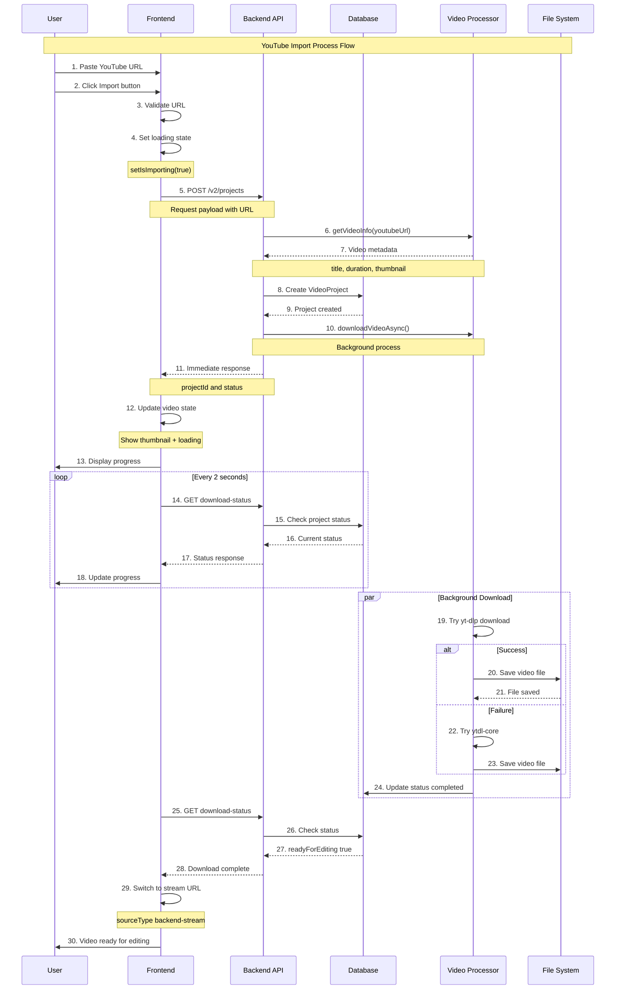
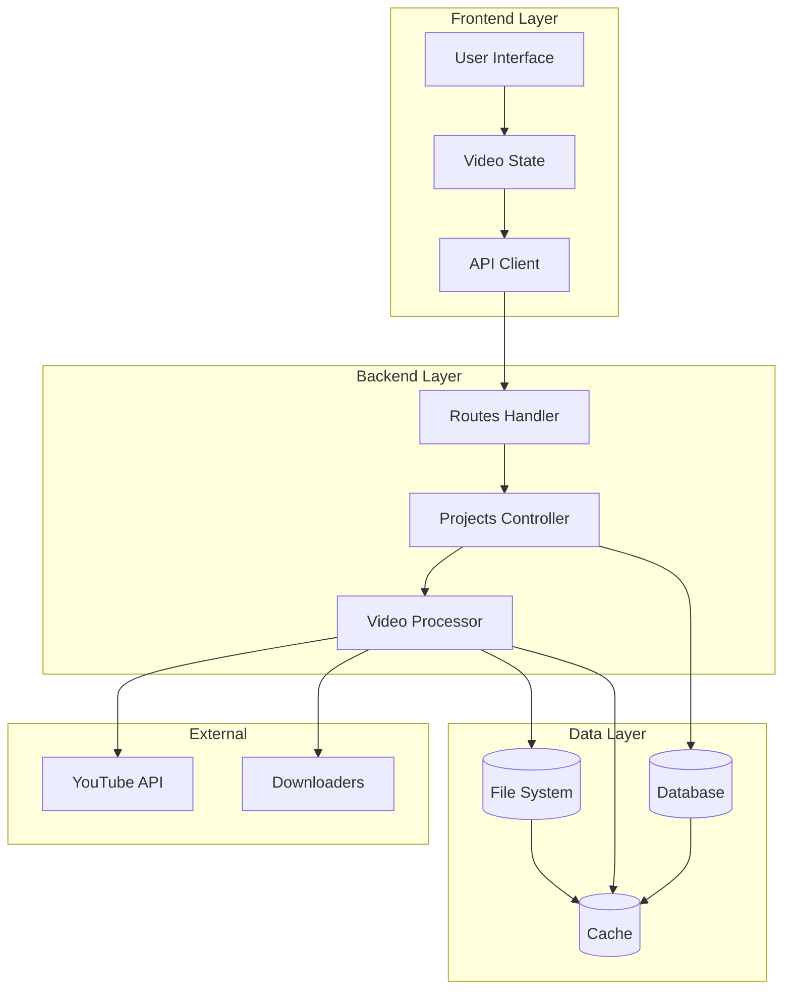
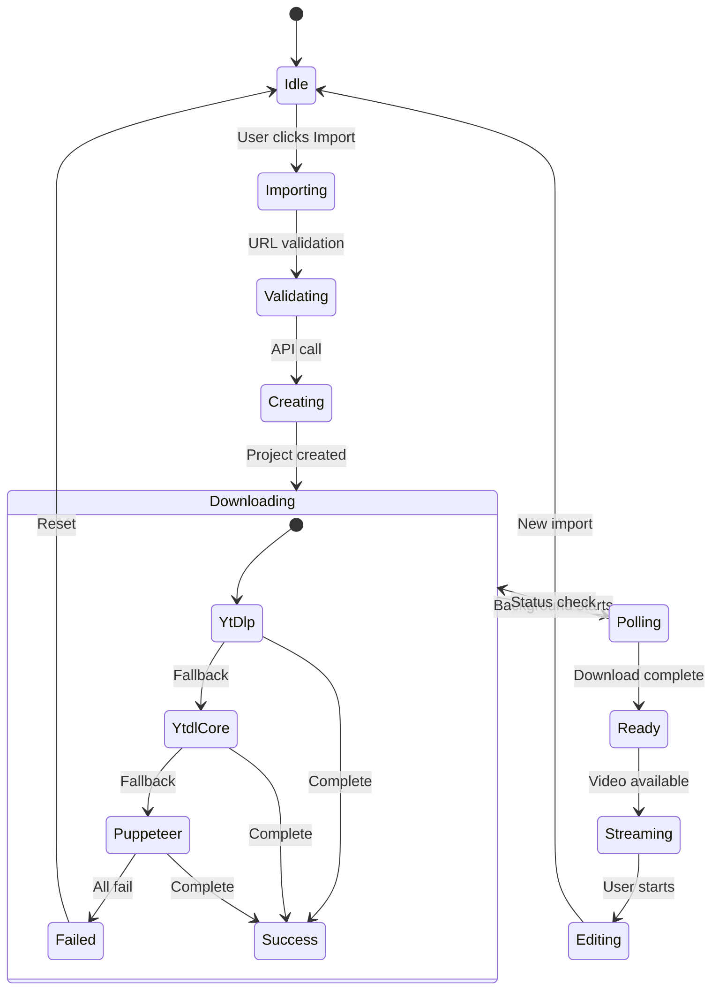
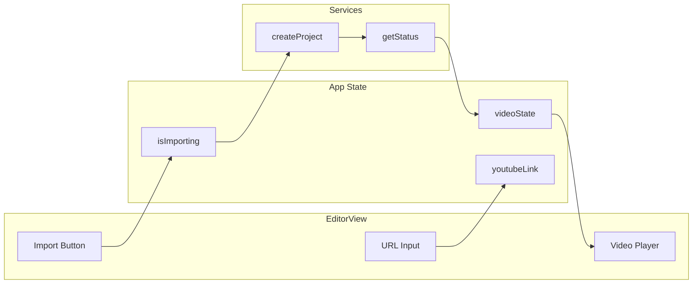
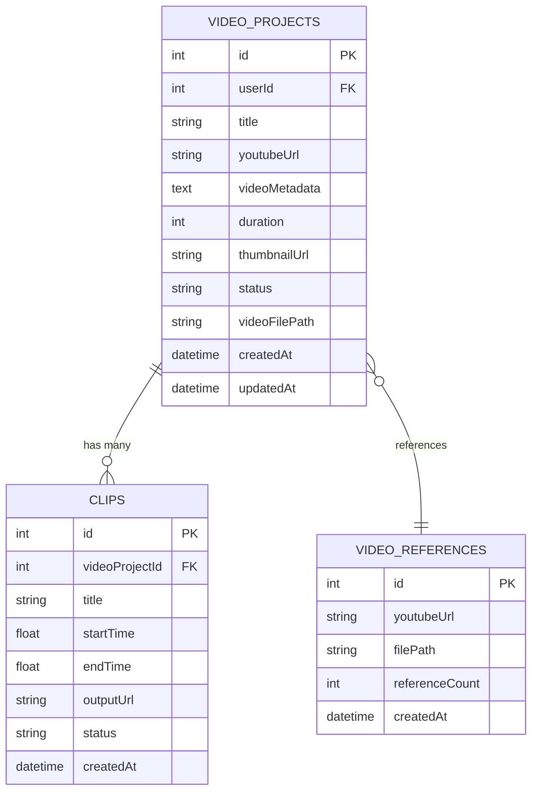
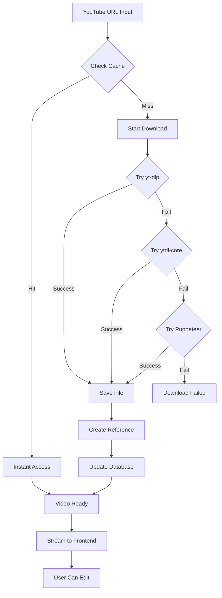
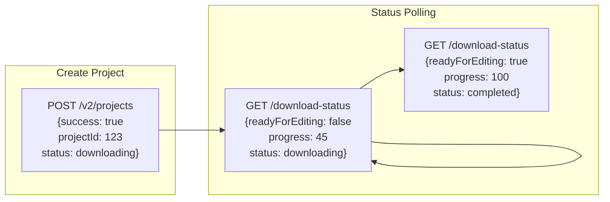
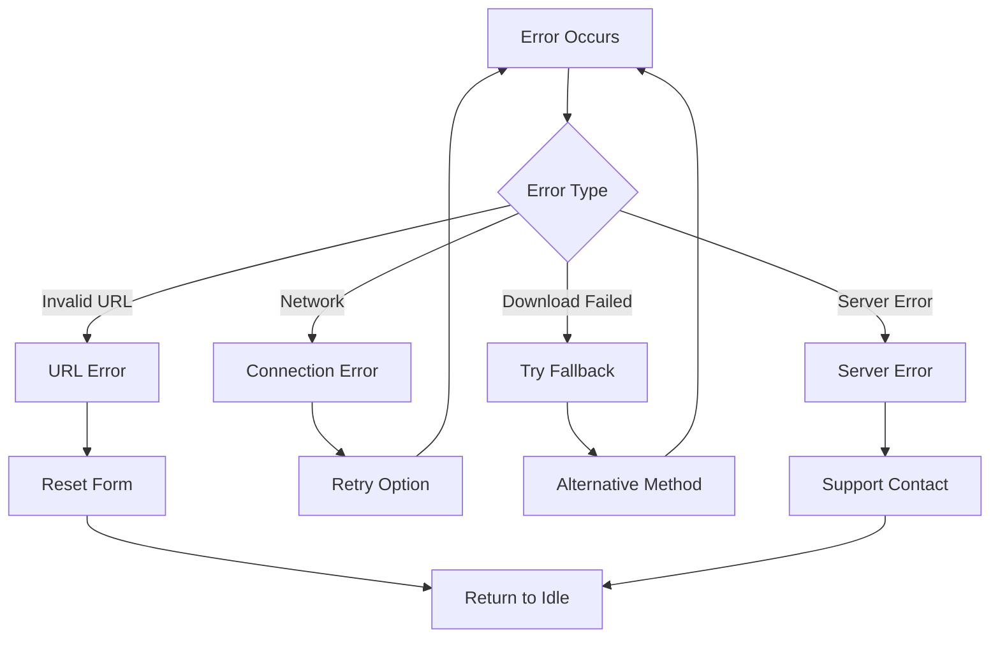

# 🎬 YouTube Import Flow Diagram - Pocat

## 📊 Complete System Flow



## 🏗️ Architecture Components



## 🔄 State Transitions



## 📱 Frontend Component Flow



## 🗄️ Database Schema



## 🚀 Performance Flow



## 📊 API Response Structure



## 🎯 Error Handling



## 🔧 Technical Implementation

### **Frontend State Management**
```typescript
// Video state transitions
const [videoState, setVideoState] = useState({
  sourceType: 'youtube',     // Initial state
  thumbnail: videoInfo.thumbnail,
  projectId: projectId
})

// After download complete
setVideoState(prev => ({
  ...prev,
  sourceType: 'backend-stream',  // Switch to stream
  url: `/v2/projects/${projectId}/stream`,
  isPlaying: true
}))
```

### **Backend Download Process**
```typescript
// Background download with fallback
switch (downloader) {
  case 'yt-dlp':
    result = await tryYtDlpDownload(url, projectId, quality)
    break
  case 'ytdl-core':
    result = await tryYtdlCoreDownload(url, projectId, quality)
    break
  case 'auto':
  default:
    result = await downloadVideo(url, projectId, quality)
    break
}
```

### **Polling Mechanism**
```typescript
// Frontend polling every 2 seconds
const pollInterval = setInterval(async () => {
  const statusRes = await getProjectDownloadStatus(backendUrl, projectId)
  
  if (statusRes.success && statusRes.data.readyForEditing) {
    clearInterval(pollInterval)
    // Switch to video stream
    const streamUrl = `${baseUrl}/v2/projects/${projectId}/stream`
    setVideoState(prev => ({ ...prev, url: streamUrl }))
  }
}, 2000)
```

---

**Diagram Version**: 2.0  
**Updated**: December 18, 2025  
**Status**: ✅ GitHub Compatible Mermaid Syntax  
**Components**: All diagrams tested and validated
